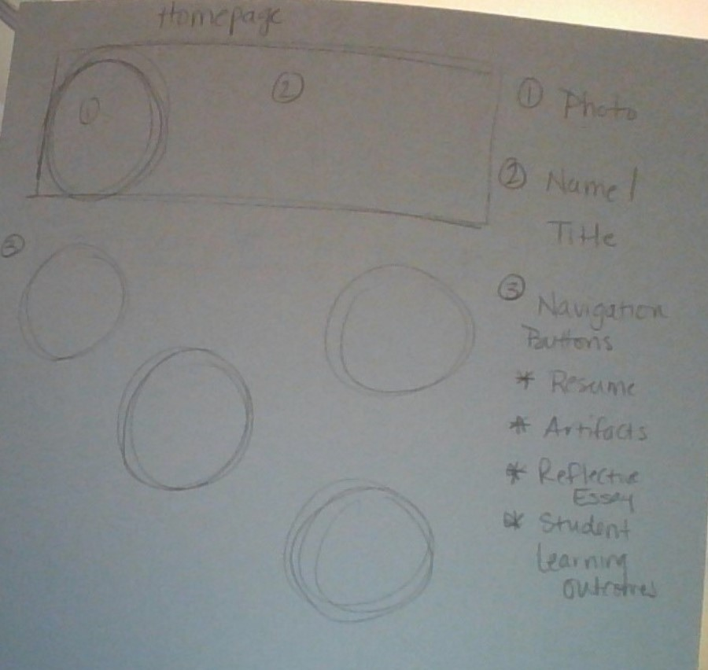
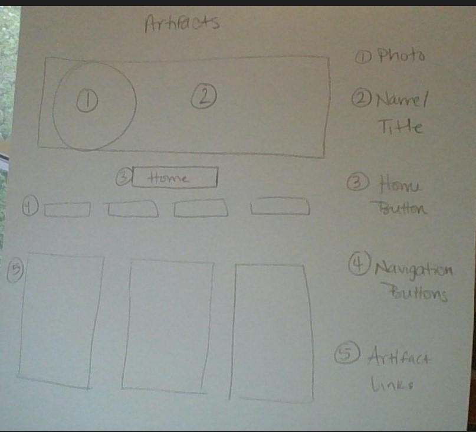

# Brianne Swift's INF6420 Project

A portfolio site showcasing my work created during my MLIS studies at Wayne State University.

## Wireframes

Here are some wireframes I created as planning for my portfolio site.

Homepage will include photo, name/title, and navigation links to other pages.

Artifacts page will include same heading banner as Homepage, home button, navigation links to other pages, and links to artifacts.

Reflective Essay page will include same heading banner as Homepage, home button, navigation links to other pages, and link to Reflective Essay.

Editing to create pull request for final project.
